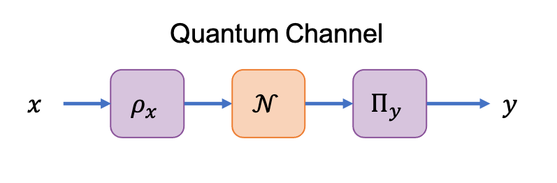

# CV Background

The communication value (CV) measures the performance of classical communication
over a channel.

## Classical Channels

A classical channel ``\mathbf{P} : [n] \to [n']`` is treated as a black-box
with transition probabilities ``P(y|x)`` where ``x\in[n]`` and ``y\in[n']``.


The communication value ``(\text{cv})`` of a classical channel is defined as:

```math
\text{cv}(\mathbf{P}) = \sum_{y\in[n']} \max_{x\in[n]} P(y|x).
```

The communication value is analogous to the maximal
success probability of guessing the input ``x`` given the output ``y``.
Furthermore, this quantity can be applied to any communication channel that can
be characterized by its transition probabilities ``P(y|x)`` and is therefore a
device-independent measure of communication performance.

## Quantum Channels

A quantum channel is defined as a completely-positive trace-preserving map
``\;\mathcal{N} \in \text{CPTP}(A \to B)`` where ``A`` and ``B`` denote the input
and output Hilbert spaces respectively.



Classical communication over a quantum channel is performed in three steps:
1. The input ``\;x\in[n]`` is encoded into a quantum state ``\;\rho_x\in\mathcal{H}^A``
   on the input Hilbert space.
2. State ``\;\rho_x`` is sent through the quantum channel ``\;\mathcal{N}`` evolving
   the state to ``\;\mathcal{N}(\rho_x)\in\mathcal{H}^B`` on the output Hilbert sapce.
3. The evolved state is measured with the positive operator-valued measure (POVM)
   ``\;\{\Pi_y\}_{y=1}^{n'}`` to decode the value ``\;y\in[n']``.

We note that the formal restrictions on quantum states are ``\;\rho_x\in\mathcal{H}^A``,
``\;\rho_x = \rho_x^{\dagger}``, ``\;\text{Tr}[\rho_x] = 1``, and ``\;\rho_x \geq 0``.
Likewise, the restrictions on POVMs are ``\;\Pi_y \in \mathcal{H}^B``, ``\;\Pi_y \geq 0``,
``\;\Pi_y = \Pi_y^{\dagger}``, and ``\;\sum_{y=1}^{n'}\Pi_y = \mathbb{I}_B``.


The communication value of a quantum channel ``\;\mathcal{N}`` is defined as:

```math
\text{cv}(\mathcal{N})=
    \max_{\{\Pi_y\}_{y=1}^{n'}, \{\rho_x \}_{x=1}^n}
    \{\text{cv}(\mathbf{P}) \; | \; P(y|x) = \text{Tr}[\Pi_y\mathcal{N}(\rho_x)]\},
```

where ``\;n, n'\in \mathbb{N}`` are selected as the smallest integers that yield
the maximal value for the communication value.
In practice, ``\;n=n'=d_B^2`` where ``\;d_B`` is the Hilbert space dimension of the
POVM measurement.

The communication value of a quantum channel can alternatively be cast as an
optimization over the separable cone, ``\;\text{SEP}(A\;:\;B)``, where ``\;A`` and
``\;B`` are the input and output Hilbert spaces of channel ``\;\mathcal{N}``.
The communication value of a quantum channel then takes the form:

```math
\begin{aligned}
    \text{cv}(\mathcal{N})& = \max_{\Omega^{AB}} \text{Tr}[\Omega^{AB}J_{\mathcal{N}}] \\
    \hspace{1cm}
    & \text{s.t.} \quad \text{Tr}_A[\Omega^{AB}] = \mathbb{I}^B; \\
    \hspace{1cm}
    & \qquad \Omega^{AB} \in \text{SEP}(A\;:\;B),
\end{aligned}
```

where the quantum channel ``\;\mathcal{N}`` is represented by its
[`Choi`](@ref) operator ``\;J_{\mathcal{N}}``.

## Certifying Communication Value

In general cases, the communication value of a quantum channel is challenging
to compute.
However, upper and lower bounds can be computed with relative efficiency:
* The upper bound is computed using the [`pptCV`](@ref) method to evaluate the
  `:dual` of the [PPT Relaxation of the CV](@ref).
* The lower bound is computed using the [`seesawCV`](@ref) method to evaluate the
  [See-Saw Optimization of the CV](@ref).

Using these bounds, we certify the communication value as:

```math
\text{seesawCV}(\mathcal{N}) \leq \text{cv}(\mathcal{N}) \leq \text{pptCV}(\mathcal{N}, \text{:dual})
```
