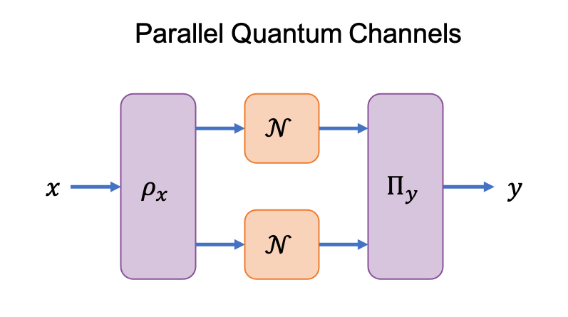

```@meta
CurrentModule = CVChannel
```
# CV Multiplicativity

An objective of this software is identify when parallel quantum channels have a
communication value greater than the product of its constituents.



This super-multiplicativity, is a nonclassical feature of quantum communication
systems that results from the entanglement across the input and output Hilbert
spaces of the two parallel channels.
Formally, we define the communication value of two quantum channels ``\mathcal{N}``
and ``\mathcal{M}`` to be super-multiplicative when

```math
\text{cv}(\mathcal{N})\text{cv}(\mathcal{M}) \leq \text{cv}(\mathcal{N}\otimes\mathcal{M}).
```

For classical channels, the input and output Hilbert spaces are separable, hence,
the communication value is always found to be multiplicative (equality holds for
the above expression).

## Certifying Super-Multiplicativity

To numerically verify that the communication value of two (or more) channels is
super-multiplicative we take the following approach:

1. Use the dual of [`pptCV`](@ref) to evaluate an upper bound for ``\text{cv}(\mathcal{N})``.
2. Use the [`seesawCV`](@ref) to evaluate a lower bound for ``\text{cv}(\mathcal{N}\otimes\mathcal{N})``.
3. Super-multiplicativity is confirmed if ``\text{pptCV}(\mathcal{N}, \text{:dual})^2 \leq \text{seesawCV}(\mathcal{N}\otimes\mathcal{N})``.

Since the `:dual` of [`pptCV`](@ref) and [`seesawCV`](@ref) loosely bound the
communication value.
A confirmation of super-multiplicativity is certain however, false negatives may
occur.
For channels satisfying ``\text{SEP}(A\;:\;B) = \text{PPT}(A\;:\;B)``
the [`pptCV`](@ref) method computes the exact communication value.
For this case, we provide the following utility:

```@docs
pptCVMultiplicativity
```

## N-Fold Werner-Holevo Channel

```@docs
wernerHolevoCVPPT
generalWHLPConstraints
WHIDLP
```
